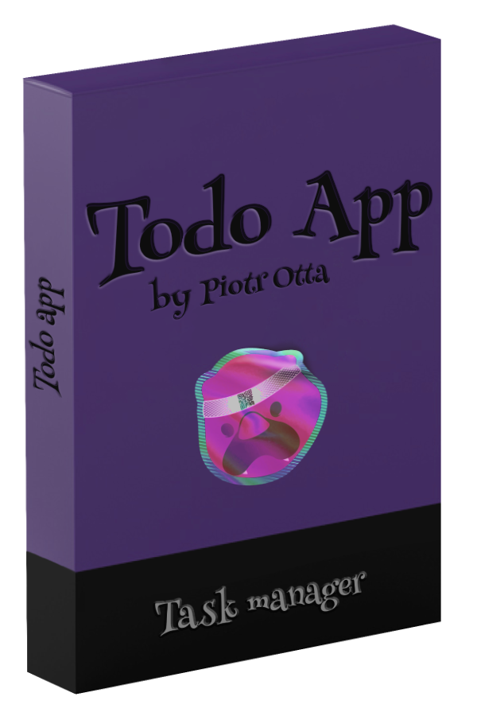
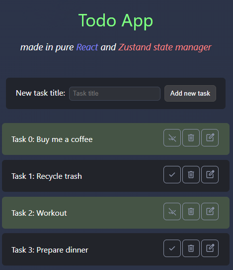
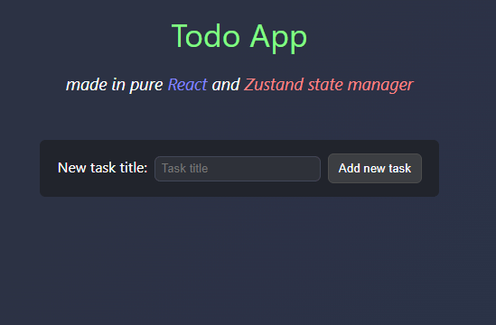
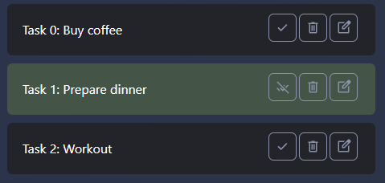
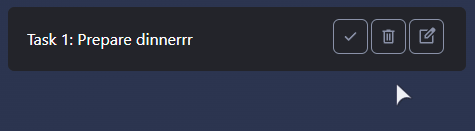
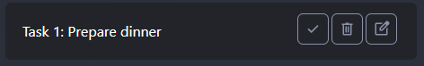
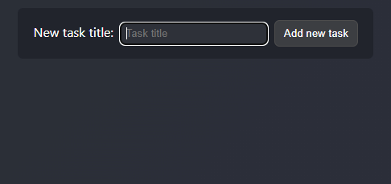

<h1 style="text-align:center;">
Todo App
</h1>

<p style="text-align:center;">
   
</p>


## Table Of Content

- [About](#about)
- [Features](#features)
- [Libraries used](#libraries-used)
  - [Production dependencies](#production-dependencies)
  - [Development dependencies](#development-dependencies)
- [Instalation](#installation)
- [Usage](#usage)
- [Accessibility](#accessibility)

## About

A very small Todo app built entirely with **React 19.0.0** and powered by **Zustand** state manager v5.0.3. App created for learning purposes.

<p>

</p>

## Features

- **Create tasks**: Add tasks with a title and completed state.

<p>

</p>

- **Delete tasks**: Remove tasks from the list.

<p>

</p>

- **Edit tasks**: Modify the title of existing tasks.

<p>

</p>

- **Toggle completion of the tasks**: Mark tasks as completed or revert them to incomplete.

<p>

</p>

- **Keyboard friendly**: Navigate the entire app using only the keyboard (tabs, space/enter to interact with buttons and inputs).

<p>

</p>

## Libraries Used

### Production Dependencies
- **React 19.0.0**: core library for building the app,
- **Zustand 5.0.3**: state management,
- **uuid**: generate unique IDs for tasks.

### Development Dependencies
- **ESLint**: linting and errors,
- **Prettier**: code formatting,
- **web-vitals**: measure performance (comes bundled with **React**).

## Installation

1. If you don't have Node.js installed or if your current version is not compatible, please install Node.js **v20.17.0** from the [NodeJS website](https://nodejs.org/) or via **NVM** (**N**ode **V**ersion **M**anager). 

2. Clone the repository:
   ```bash
   git clone https://github.com/PiotrOtta/todo_app_react.git
   ```
3. Navigate to the project directory:
   ```bash
   cd todo_app_react
   ```
4. Install dependencies:
   ```bash
   npm install
   ```


## Usage

1. Start the development server:
   ```bash
   npm dev
   ```
   or 
   ```bash
   npm start
   ```
2. Open your browser and visit:
   ```
   http://localhost:3000
   ```

## Accessibility

This app is fully accessible for keyboard users.
- Use **Tab** to navigate through the app.
- Use **Space** or **Enter** to interact with buttons and inputs.

